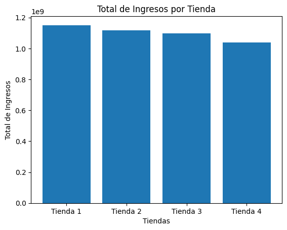
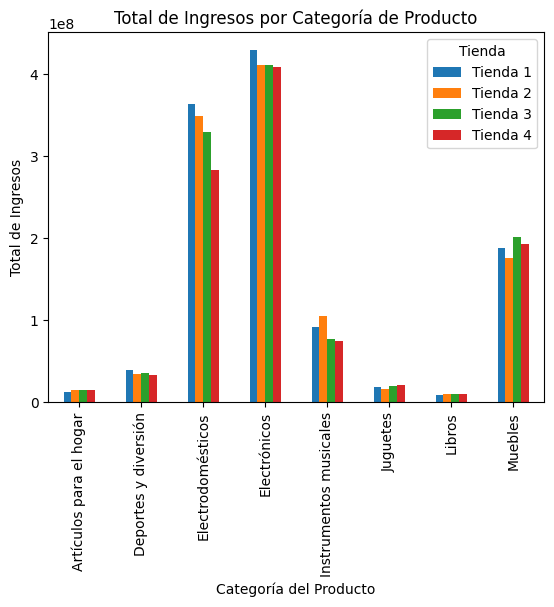
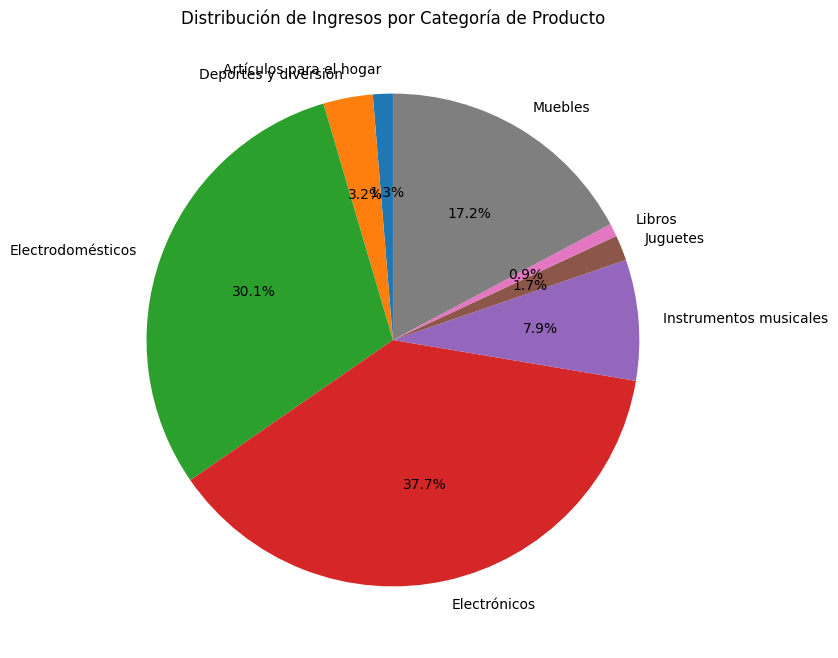
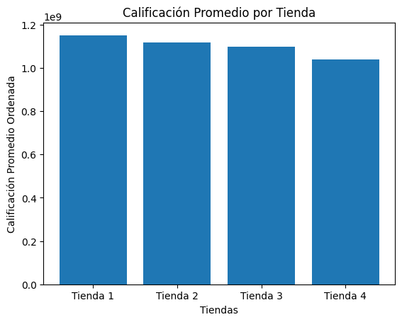
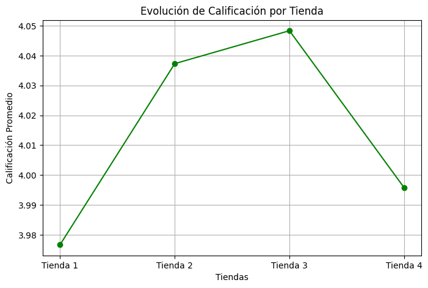

# INFORME DE TIENDAS

Estimado Sr. Juan, un gusto saludarle

Informo a usted, y a quien estime conveniente, resultado de análisis de la información de sus tiendas, ello con el fin de determinar cual tienda presenta menores índices de ventas, de calificación de clientes y mayores costos de envió por producto; además de dar información valiosa respecto a que productos son los más y menos vendidos a fin de facilitar toma de decisiones para continuidad de las demás tiendas y que potenciar en ellas.

Este informe es en base a información proporciada, con ello tendra a mano toda la información de datos no de supuestos o corazonadas respecto a una correcta toma de desiciones, este camino es lo que convella ventaja respecto a competidores dado que paso a paso al usar los datos se esta transformando en una empresa data driven.

## Objetivo:

- Analizar registro de ventas entre los periodos enero 2020 a marzo 2023.
- Determinar que tiendas produce mayor y menor facturación
- Determinar que categorías y productos tienen mejor y peor venta
- Determinar ranking promedio de costos de envió por productos

## **1.\_ Análisis de Facturación**

Se revisaron datos de ventas acorde a información enviada para los
periodos ya indicados, el resultado de ello es:

| Tienda   | Total de Ingresos en $ |  
|---------|------------------------|  
| Tienda 1 | 1,150,880,400  |  
| Tienda 2 | 1,116,343,500  |  
| Tienda 3 | 1,098,019,600  |  
| Tienda 4 | 1,038,375,700  |  

- El mayor ingreso es de Tienda 1: $1,150,880,400
- El menor ingreso es de Tienda 4: $1,038,375,700

## **2.\_ Análisis por categoría de productos**

Tras comparar las diversas categorías, con ello los productos asociados y sus ventas, tenemos este resultado que se expresa en moneda nacional (\$):

| Categoría del Producto   | Tienda 1     | Tienda 2     | Tienda 3     | Tienda 4     |  
|-------------------------|-------------|-------------|-------------|-------------|  
| Artículos para el hogar  | 12,698,400  | 14,746,900  | 15,060,000  | 15,074,500  |  
| Deportes y diversión     | 39,290,000  | 34,744,500  | 35,593,100  | 33,350,100  |  
| Electrodomésticos        | 363,685,200 | 348,567,800 | 329,237,900 | 283,260,200 |  
| Electrónicos             | 429,493,500 | 410,831,100 | 410,775,800 | 409,476,100 |  
| Instrumentos musicales   | 91,299,000  | 104,990,300 | 77,380,900  | 75,102,400  |  
| Juguetes                 | 17,995,700  | 15,945,400  | 19,401,100  | 20,262,200  |  
| Libros                   | 8,784,900   | 10,091,200  | 9,498,700   | 9,321,300   |  
| Muebles                  | 187,633,700 | 176,426,300 | 201,072,100 | 192,528,900 |  

Dado este factor podemos indicar que:

- Las 3 principales categorías de ventas son de tipo Electrónicos,  Electrodomésticos y muebles
- Las 3 categorías con menor venta son Libros, Artículos para el hogar y   juguetes.

## **3.\_ Calificación promedio por tiendas**

Tras analizar las evaluaciones que entregan nuestros clientes por sus compras, podemos determinar que:
| Tienda   | Calificación Promedio Ordenada |  
|---------|------------------------------|  
| Tienda 3 | 4.0483  |  
| Tienda 2 | 4.0373  |  
| Tienda 4 | 3.9958  |  
| Tienda 1 | 3.9767  |  

- La mejor calificación es de la Tienda 3: 4.0483
- La peor calificación es de la Tienda 1: 3.9767

## **4.\_ Productos más y menos vendidos**
| Producto                   | Total de Ventas en $ |  
|----------------------------|----------------|  
| TV LED UHD 4K              | 432,489,600    |  
| iPhone 15                  | 401,051,200    |  
| Refrigerador               | 384,937,400    |  
| Smart TV                   | 290,221,800    |  
| Lavadora de ropa           | 242,468,600    |  
| Lavavajillas               | 240,536,500    |  
| Tablet ABXY                | 219,012,800    |  
| Secadora de ropa           | 210,238,000    |  
| Celular ABXY               | 157,911,100    |  
| Batería                    | 147,806,300    |  
| Cama king                  | 135,780,400    |  
| Estufa                     | 130,871,100    |  
| Guitarra eléctrica         | 129,404,800    |  
| Sofá reclinable            | 123,279,100    |  
| Microondas                 | 115,699,500    |  
| Cama box                   | 104,097,800    |  
| Bicicleta                  | 96,487,500     |  
| Armario                    | 96,245,800     |  
| Silla de oficina           | 69,099,000     |  
| Guitarra acústica          | 58,898,100     |  
| Mesa de noche              | 58,419,500     |  
| Impresora                  | 56,227,300     |  
| Kit de bancas              | 53,284,900     |  
| Mesa de comedor            | 46,815,700     |  
| Sillón                     | 40,796,800     |  
| Asistente virtual          | 34,468,100     |  
| Juego de mesa              | 32,451,800     |  
| Set de ollas               | 30,506,400     |  
| Smartwatch                 | 29,929,800     |  
| Mesa de centro             | 29,842,000     |  
| Auriculares con micrófono  | 22,748,500     |  
| Auriculares                | 16,516,300     |  
| Mochila                    | 16,065,700     |  
| Carrito de control remoto  | 14,767,700     |  
| Olla de presión            | 12,928,800     |  
| Pandereta                  | 12,663,400     |  
| Modelado predictivo        | 12,616,100     |  
| Balón de baloncesto        | 9,759,000      |  
| Iniciando en programación  | 9,625,500      |  
| Balón de voleibol          | 9,099,800      |  
| Ciencia de datos con Python| 9,036,100      |  
| Muñeca bebé                | 8,591,500      |  
| Cubertería                 | 8,560,400      |  
| Vaso térmico               | 8,497,400      |  
| Bloques de construcción    | 6,802,100      |  
| Dashboards con Power BI    | 6,418,400      |  
| Set de vasos               | 5,584,200      |  
| Ajedrez de madera          | 5,149,100      |  
| Dinosaurio Rex             | 3,112,900      |  
| Cuerda para saltar         | 3,068,300      |  
| Cubo mágico 8x8           | 2,729,300      |  

- El producto más vendido es \*\*TV LED UHD 4K\*\* con un total de ventas de \$432,489,600
- El producto menos vendido es \*\*Cubo mágico 8x8\*\* con un total de ventas de \$2,729,300

Ahora revisando cantidad neta vendida por productos, este es el escenario de mayores y menores ventas:

Dado lo anterior podemos indicar con claridad que:

- El producto más vendido es \*\*Mesa de noche\*\* con 210 ventas.
- El producto menos vendido es \*\*Celular ABXY\*\* con 157 ventas.

**5.\_ Despachos y/o envíos con sus costos promedios por tienda**

Dado que muchos productos deben ser enviados a la dirección que el cliente solicita, podemos indicar el promedio de este ítem por cada tienda, expresado en moneda nacional.

Relacionando cantidad de ventas versus el costo promedio de envió, podemos afirmar cuales son los productos más
caros en enviar:  

**Conclusión:**

Según los datos del informe, **Tienda 4** presenta los menores ingresos entre todas las tiendas, con un total de **\$1,038,375,700**. Además, al comparar calificaciones de clientes, no es la mejor valorada (aunque no es la peor). Si el objetivo es reducir costos y optimizar el negocio, podrías considerar vender esta tienda para concentrar recursos en las de Mayor rendimiento.

Adicionalmente se sugiere enfocar los productos en venta en todas las tiendas, los datos analizados demuestran productos con poca venta, pero alto costo en despacho lo cual gatilla en menor ganancia para la empresa, ejemplo Tablex ABXY.

**Recomendaciones adicionales**

Para potenciar los productos y mejorar el rendimiento de sus tiendas se sugieren estrategias digitales que pueden ayudar a aumentar las ventas y mejorar la experiencia del cliente:

**🚀 1. Estrategia en Redes Sociales**

✅ Instagram y TikTok: Publicaciones y videos cortos mostrando productos con promociones exclusivas.
✅ Facebook y WhatsApp: Creación de catálogos interactivos y atención personalizada por mensajería.

**📈 2. Optimización del E-commerce y Marketplace**

✅ Mejoras en la tienda online: Implementar filtros avanzados, reseñas de productos y una interfaz intuitiva.
✅ Publicidad segmentada: Anuncios en Google Ads y Meta Ads dirigidos a clientes potenciales en Colombia.
✅ Marketplaces: Publicar productos en plataformas como MercadoLibre o Linio para alcanzar más clientes.

**🔥 3. Estrategia SEO y Contenido Digital**

✅ Blog de contenido útil: Artículos sobre tecnología, electrodomésticos y consejos de decoración.
✅ SEO para posicionamiento: Optimizar títulos y descripciones para aparecer en búsquedas de Google.
✅ Email Marketing personalizado: Ofertas y descuentos exclusivos para clientes frecuentes.

**🎯 4. Experiencia de Compra Digital**

✅ Pruebas virtuales: Simulaciones en realidad aumentada para muebles y tecnología.
✅ Atención automatizada: Chatbots en el sitio web para dudas rápidas y recomendaciones personalizadas.
✅ Programa de fidelización: Puntos y descuentos especiales para compras recurrentes.

**📊 5. Estrategias de Retención y Engagement**

✅ Gamificación: Desafíos y sorteos en redes sociales con premios atractivos.
✅ Encuestas de satisfacción: Recolectar opiniones para mejorar productos y experiencia.
✅ Ofertas Flash: Descuentos de tiempo limitado para generar urgencia de compra.

Abril 2025.
Miguel Venegas T.
miguel.venegas @ gmail com
